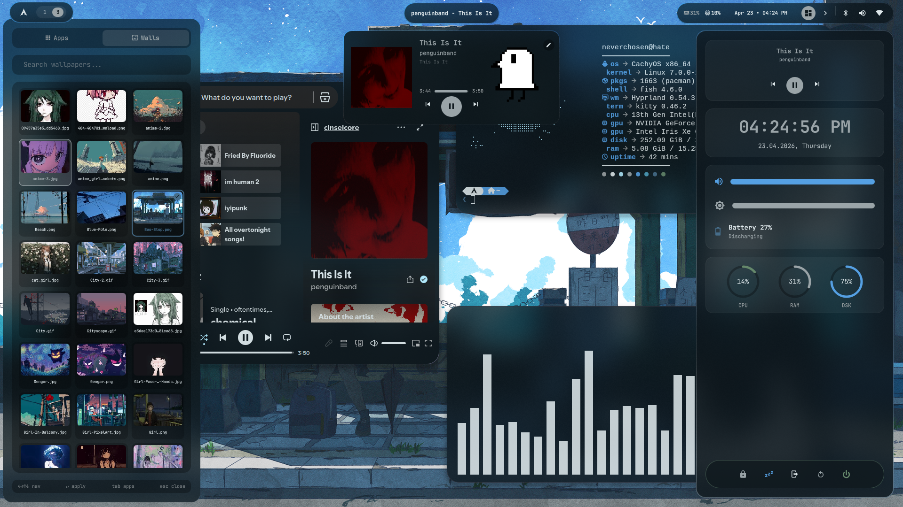

<div align="center">
i dont even know if these will work for you so use it at your own risk
  you might have to troubleshoot some stuff
  
# noerv's hyprland rice

**pywal-powered hyprland setup on cachyos**


</div>

---

## what's in here

- **hyprland** — compositor, animations, keybinds
- **quickshell** — custom qml shell: bar, dashboard, audio/bluetooth/wifi/calendar/launcher/music panels, notification center,status bar
- **rofi** — app launcher + applets (powermenu, volume, brightness, screenshot)
- **kitty** — terminal
- **hyprlock** — lock screen with blurred wallpaper + clock
- **swayosd** — volume/brightness overlay
- **swaync** — notification daemon
- **?waybar?** — status bar themed via pywal (not used but is still there)
- **fastfetch** — system info with custom ascii logo
- **fish** — shell with tide prompt and wal-sync
- **pywal** theming across: waybar, rofi, kitty, zen browser, spotify, discord, swayosd, swaync

---

## screenshots



---

## required packages

### pacman

```bash
sudo pacman -S hyprland waybar rofi kitty hyprlock hypridle \
  hyprpolkitagent python-pywal swayosd swaync \
  fastfetch fish wl-clipboard grim slurp hyprshot \
  playerctl brightnessctl wireplumber pipewire pipewire-pulse pipewire-alsa \
  nwg-look qt5ct qt6ct kvantum \
  ttf-jetbrains-mono-nerd ttf-meslo-nerd \
  noto-fonts noto-fonts-cjk noto-fonts-emoji \
  wlogout uwsm starship spicetify-cli
```

### aur (paru)

```bash
paru -S python-pywalfox pywal-discord-git \
  bibata-cursor-theme-bin \
  whitesur-icon-theme-git \
  gruvbox-plus-icon-theme-git \
  quickshell-git \
  matugen-bin
```

---

## install

```bash
git clone https://github.com/noervthere/hyprland-rice.git ~/hyprland-rice
cd ~/hyprland-rice
bash install.sh
```

or copy manually:

```bash
cp -r .config/hypr        ~/.config/hypr
cp -r .config/waybar      ~/.config/waybar
cp -r .config/quickshell  ~/.config/quickshell
cp -r .config/rofi        ~/.config/rofi
cp -r .config/kitty       ~/.config/kitty
cp -r .config/wal         ~/.config/wal
cp -r .config/swayosd     ~/.config/swayosd
cp -r .config/fastfetch   ~/.config/fastfetch
cp -r .config/fish        ~/.config/fish
cp -r .config/spicetify   ~/.config/spicetify
cp -r .local/bin/*        ~/.local/bin/
chmod +x ~/.local/bin/*
chmod +x ~/.config/wal/done.sh
chmod +x ~/.config/hypr/scripts/*.sh
chmod +x ~/.config/quickshell/update-menu-style.sh
cp -r wallpapers ~/wallpapers
wal -i ~/wallpapers/Lain.jpg
killall waybar; waybar &
~/.local/bin/start-quickshell.sh
```

### fish plugins

```bash
fish -c "curl -sL https://raw.githubusercontent.com/jorgebucaran/fisher/main/functions/fisher.fish | source && fisher install jorgebucaran/fisher && fisher update"
```

### zen browser

```bash
pywalfox install
```

### spotify

```bash
spicetify config current_theme Pywal
spicetify apply
```

---

## pywal

`~/.config/wal/done.sh` runs after every `wal -i <wallpaper>` and themes everything:

| app | method |
|-----|--------|
| waybar | `colors-waybar.css` template |
| rofi | `colors-rofi.rasi` template |
| kitty | built-in pywal |
| swaync | `colors-swaync.css` template |
| zen browser | `pywalfox update` |
| spotify | `spicetify apply` |
| discord | quickcss symlinked to generated discord colors |
| swayosd | `swayosd-colors-watch` daemon |

---

## quickshell

custom qml shell. components in `.config/quickshell/components/`:

- `IslandBar.qml` — dynamic island bar
- `1Bar.qml` — main bar
- `Dashboard.qml` — overview panel
- `AudioPanel.qml` — volume/sink control
- `BluetoothPanel.qml` — bluetooth
- `WifiPanel.qml` — wifi
- `CalendarPanel.qml` — calendar
- `LauncherPanel.qml` — app launcher
- `MusicPanel.qml` — mpd/mpris music
- `MangaNotifications.qml` — notification center

gifs and pfps in `assets/` are used in shell widgets. swap for your own.

launch: `~/.local/bin/start-quickshell.sh` or add to hyprland `exec-once`

---

## file tree

```
.
├── .config/
│   ├── hypr/
│   │   ├── hyprland.conf
│   │   ├── animations.conf
│   │   ├── monitors.conf       <- edit for your monitors
│   │   ├── nvidia.conf         <- remove if not nvidia
│   │   ├── hyprlock.conf
│   │   └── scripts/
│   ├── waybar/
│   ├── quickshell/
│   │   ├── shell.qml
│   │   ├── components/
│   │   └── assets/
│   ├── rofi/
│   ├── kitty/kitty.conf
│   ├── wal/
│   │   ├── done.sh
│   │   └── templates/
│   ├── swayosd/
│   ├── fastfetch/
│   ├── fish/
│   └── spicetify/Themes/Pywal/
├── .local/bin/
├── wallpapers/
├── install.sh
└── README.md
```

---

## notes

-if you are using an nvdia card you can comment out the "#" for nvdia in hyprland.conf
- quickshell assets (gifs, pfps pfps arent a thing anymore) are personal — replace them
- wallpapers folder is a sample, not the full collection

---
